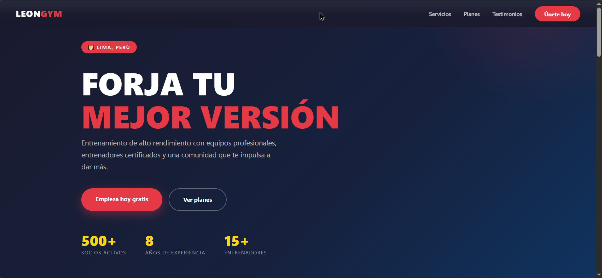
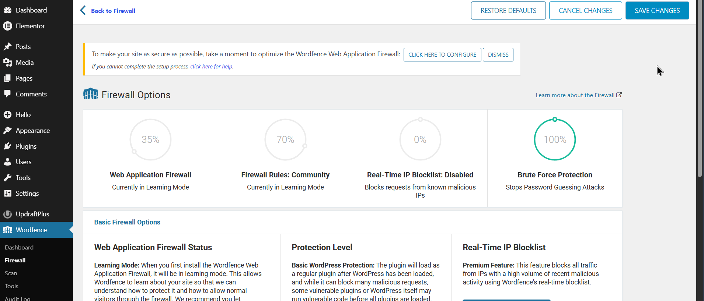
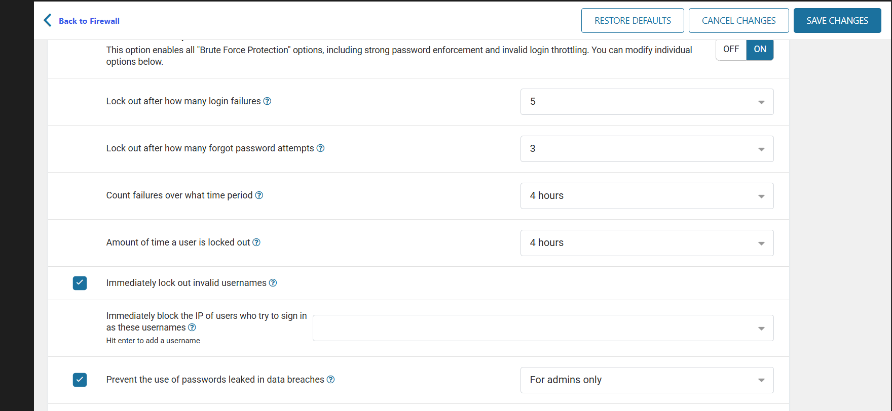
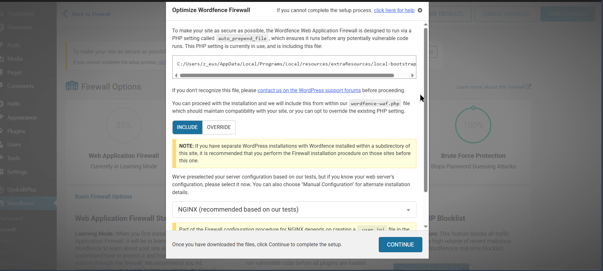
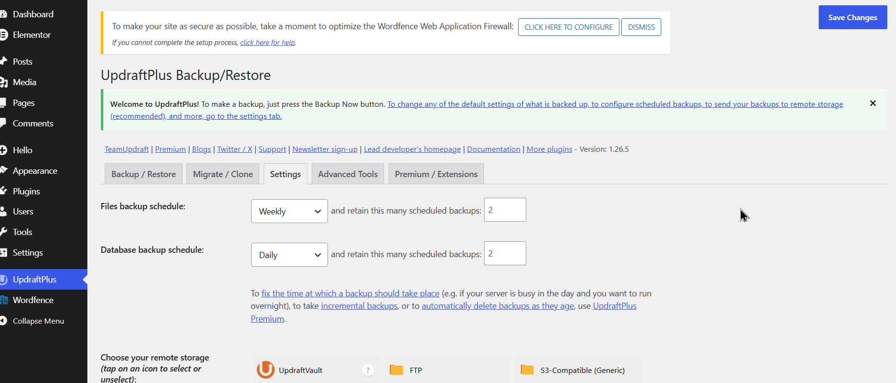
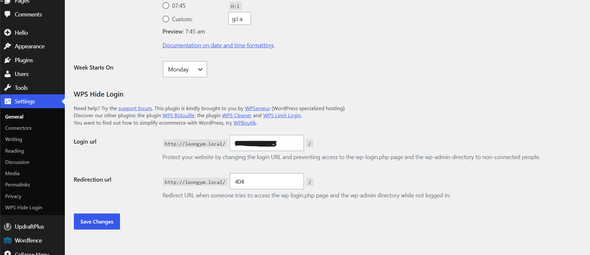
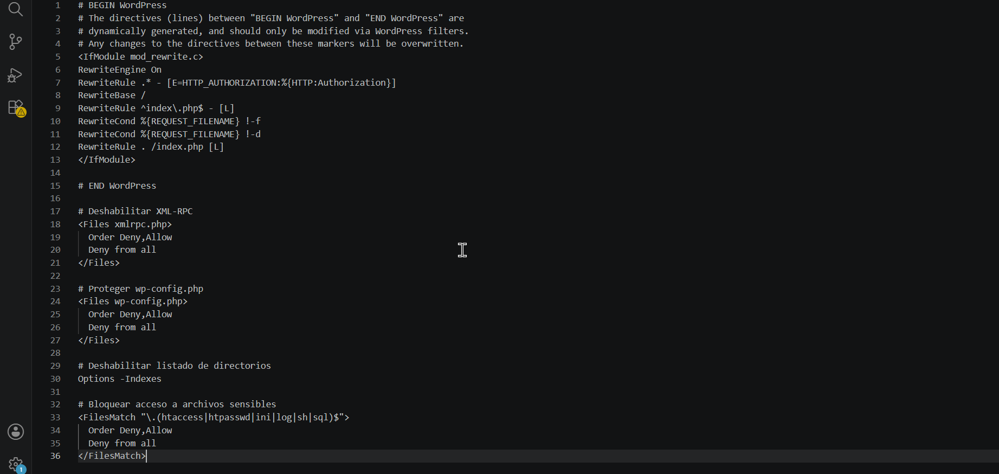
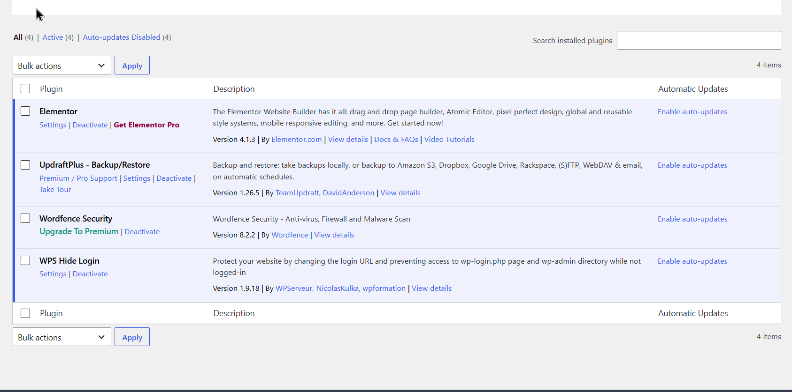

# 🏋️ LeonGym — WordPress Hardening & Security

> Proyecto WordPress real con implementación profesional de seguridad en múltiples capas.  
> Desarrollado como parte de mi portafolio de desarrollo web.

---

## 🌐 Vista previa del sitio



---

## 🛠️ Stack tecnológico

| Tecnología | Detalle |
|---|---|
| **CMS** | WordPress 7.0 |
| **Page Builder** | Elementor 4.1.3 |
| **Servidor web** | nginx |
| **PHP** | 8.2.29 |
| **Base de datos** | MySQL 8.4.0 |
| **Entorno local** | Local by Flywheel |
| **Editor** | VS Code |

---

## 🔒 Seguridad implementada

Este proyecto demuestra cómo aplicar **seguridad en capas** sobre una instalación WordPress real, combinando plugins especializados con configuración manual a nivel de servidor.

---

### 🛡️ Wordfence Security

Plugin principal de seguridad: firewall de aplicación web, antivirus y escáner de malware.



**Configuraciones aplicadas:**

#### Protección contra fuerza bruta
Límite de intentos de login fallidos, bloqueo automático de IPs maliciosas y alertas en tiempo real ante ataques.



#### Optimización y rendimiento
Ajuste fino de las reglas del firewall para maximizar protección sin afectar el rendimiento del sitio.



---

### 💾 UpdraftPlus — Backups automáticos

Sistema de respaldo automatizado con política de retención definida.



**Política de backups:**
- ✅ Backup diario automático
- ✅ Retención de **2 copias** (hoy y ayer)
- ✅ Restauración con un clic en caso de incidente

---

### 🔑 WPS Hide Login — URL de acceso personalizada

La URL por defecto `/wp-admin` y `/wp-login.php` son los primeros objetivos de ataques automatizados de fuerza bruta. Se cambió por una ruta personalizada conocida únicamente por el administrador.



**Resultado:** Los bots que atacan la ruta genérica reciben un error 404, eliminando por completo ese vector de ataque.

---

### ⚙️ Hardening en `.htaccess`

Configuración manual del archivo `.htaccess` para añadir protección a nivel de servidor Apache, independiente de cualquier plugin.



Se implementaron 4 capas de protección:

#### 1. Deshabilitar XML-RPC
```apache
# Deshabilitar XML-RPC
<Files xmlrpc.php>
  Order Deny,Allow
  Deny from all
</Files>
```
XML-RPC es una puerta trasera clásica usada para ataques de fuerza bruta amplificados. Al bloquearlo se elimina ese vector completamente.

#### 2. Proteger wp-config.php
```apache
# Proteger wp-config.php
<Files wp-config.php>
  Order Deny,Allow
  Deny from all
</Files>
```
Este archivo contiene las credenciales de la base de datos. Ninguna solicitud externa puede acceder a él.

#### 3. Deshabilitar listado de directorios
```apache
# Deshabilitar listado de directorios
Options -Indexes
```
Impide que un atacante explore la estructura de carpetas del servidor si accede a un directorio sin index.

#### 4. Bloquear acceso a archivos sensibles
```apache
# Bloquear acceso a archivos sensibles
<FilesMatch "\.(htaccess|htpasswd|ini|log|sh|sql)$">
  Order Deny,Allow
  Deny from all
</FilesMatch>
```
Bloquea el acceso directo a archivos de configuración, logs, scripts de shell y dumps de base de datos.

---

### 🔌 Plugins activos



| Plugin | Versión | Función |
|---|---|---|
| **Wordfence Security** | 8.2.2 | Firewall, antivirus, escaneo de malware |
| **WPS Hide Login** | 1.9.18 | Oculta y personaliza la URL de acceso |
| **UpdraftPlus** | 1.26.5 | Backups automáticos diarios con restauración |
| **Elementor** | 4.1.3 | Constructor visual de páginas |

---

## 📂 Estructura del repositorio

```
leongym/
├── assets/                        # Capturas de documentación
│   ├── htaccess.png
│   ├── pluggins.png
│   ├── Ruta-login.png
│   ├── UpDraftplus.png
│   ├── Wordfence.png
│   ├── Wordfence-forcebrute.png
│   └── Wordfence-optimize.png
├── wp-content/
│   ├── themes/                    # Tema activo
│   └── plugins/                   # Plugins instalados
├── .htaccess                      # Configuración de seguridad servidor
├── .gitignore                     # Archivos excluidos del repositorio
└── README.md
```

---

## ⚠️ Archivos excluidos por seguridad

Los siguientes archivos **no están en este repositorio** intencionalmente:

- `wp-config.php` — contiene credenciales de base de datos
- `wp-content/uploads/` — archivos de medios del sitio
- `wp-content/cache/` — archivos de caché temporales
- `*.log` — logs del sistema

---

## 🚀 Clonar el proyecto

```bash
git clone https://github.com/Kevin962022/gimnasio-seguridad.git
```

> ⚠️ Deberás crear tu propio `wp-config.php` con tus credenciales de base de datos locales.

---

## 👨‍💻 Autor

**Kevin962022**  
Desarrollador WordPress | Enfocado en seguridad web y buenas prácticas  
🔗 [github.com/Kevin962022](https://github.com/Kevin962022)
